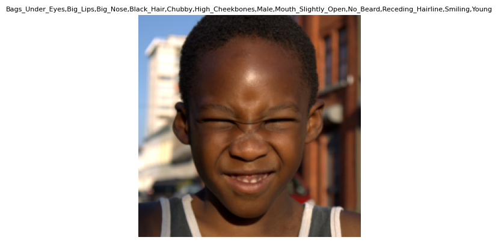

# Facial Attributes Classifier
Welcome to the Multi-Label Facial Attribute Classifier repository! This project focuses on training a robust facial attribute classifier using the Celeba-HQ dataset, which includes 40 diverse facial labels. Pretrained models can be downloaded from [here](https://drive.google.com/file/d/1ZyLgr-mbmwyYmMVkO4QJAN35sgzFirvD/view?usp=sharing).



## Installation
```
conda env create -f environment.yaml
conda activate attributes
```

## Dataset
Download the [CelebAMask-HQ](https://github.com/switchablenorms/CelebAMask-HQ) dataset. Then, split to train and test sets usings the notebook.


## Train a Classifier
```
python3 main.py --train-pkl /storage2/datasets/celeba-hq/attributes-train.pkl --test-pkl /storage2/datasets/celeba-hq/attributes-train.pkl --root-images /storage2/datasets/celeba-hq/CelebA-HQ-img/
```

